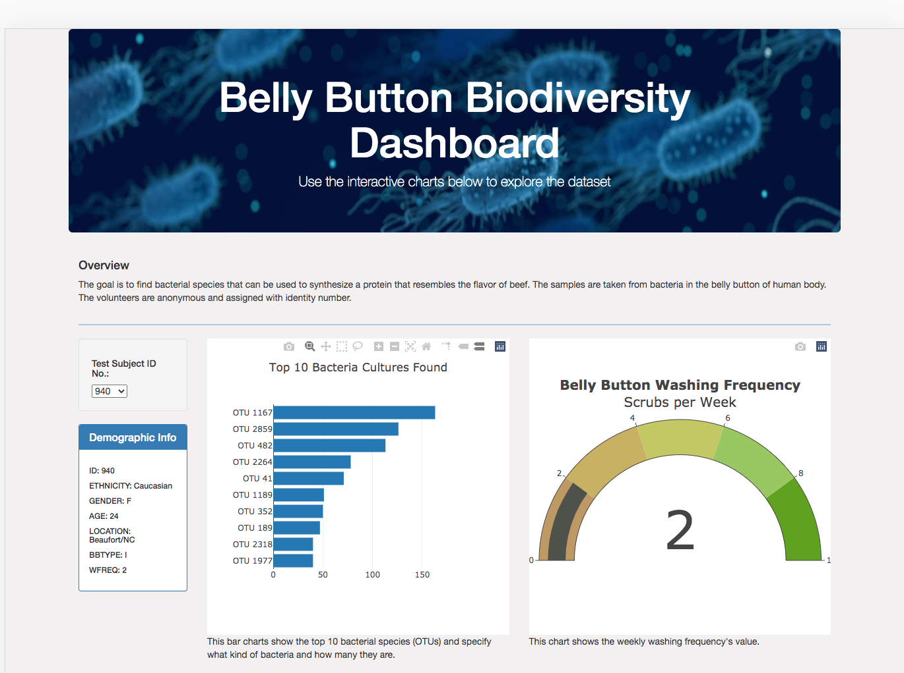
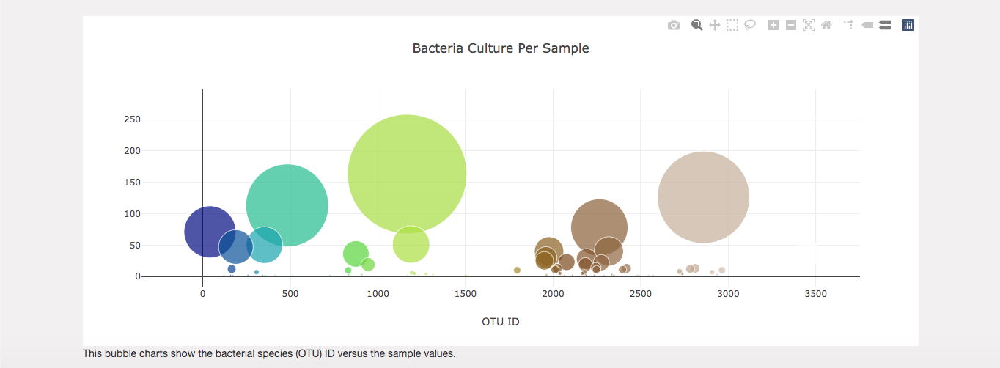

# Plotly – Data Visualization JavaScript

## Overview of Project
The goal of this project is to create an interactive data visualization for the web using Plotly.js. Plotly.js is a JavaScript data visualization library.

The following tasks to complete:
* Create basic plots with Plotly, including bar charts, bubble charts, and gauge charts.
* Use D3.json() to fetch external data, such as CSV files and web APIs.
* Parse data in JSON format.
* Use functional programming in JavaScript to manipulate data.
* Use JavaScript's Math library to manipulate numbers.
* Use event handlers in JavaScript to add interactivity to a data visualization.
* How to use interactivity to enhance your visualizations.
* Deploy an interactive chart to GitHub Pages.

## Resources and Tools
1. Plotly.js
2. D3.json 
3. Web browser: Google or FireFox
4. Command line interface

## Sample of Completed Website

## Online
Click link below or type in the browser:
https://rustiri.github.io/plotly-javascript/
